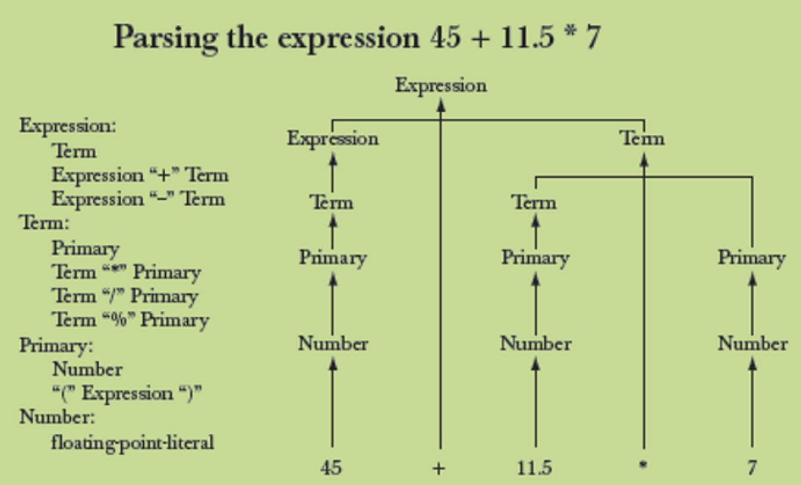
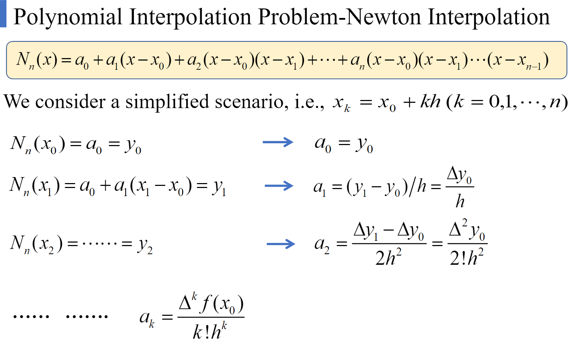

# CS241 course data
codes for CS241 Principles and Practice of Problem Solving

[课程资料](https://drive.google.com/drive/folders/1z-vLeSN1lLc_zrLrd6zl0w_Na2fULgqh?usp=sharing)

`/others`：放了一些不在作业里但挺有趣的东西

[TOC]

##### 1. assignment1

>  四则运算表达式计算

`expr.cpp`

使用讲义里方法实现的计算器

`parser.cpp`

简易的四则运算表达式解析器



##### 2. assignment2

```T1.cpp```：水题

```T2,T3```：拉格朗日与牛顿插值




##### 3. assignment3

```T1```：高斯消元

> 代码里处理无穷解和无解的方式有问题
>
> 我也不知道怎么优雅地来判断，除了求rank
>
> ~~既然它过了，我就不管了~~

```T2```：毒瘤雅各比迭代~~（不知道怎么区分无解，无穷解和不收敛~~

```T3```：水题

##### 4. assignment4

```T1```：挺有意思的cuckoo hash，~~不会算复杂度~~

```T2```：nth_element，~~口胡容易魔改难~~

##### 5. assignment5

~~助教的接口太丑了~~

`Trie`：没什么难度

`K-D Tree`：完整版见`/others`

##### 6. assignment6

`T1`：MST....

`T2`：证明贪心在背包问题的两种特殊情况下的正确性，~~我大概是证对了吧~~

##### 7. assignment7

`T1`：LCS

`T2`：遗传算法与调参

`T3`：编辑距离

##### 8. assignment8

关于机器学习的一些题目

##### 9. assignment9

Qt入门小程序ugly but usable

qfiledialog+qchart

##### 10. final

见`/final`