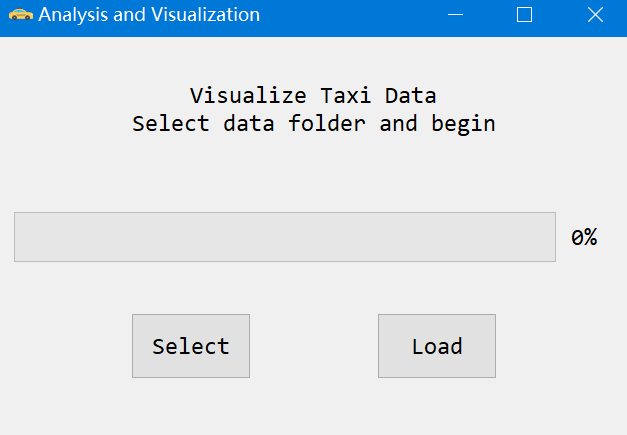
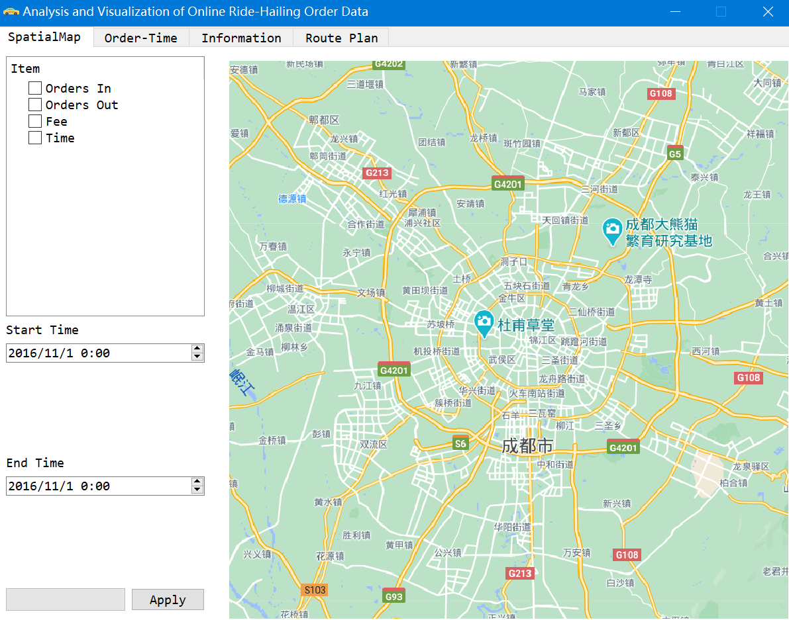
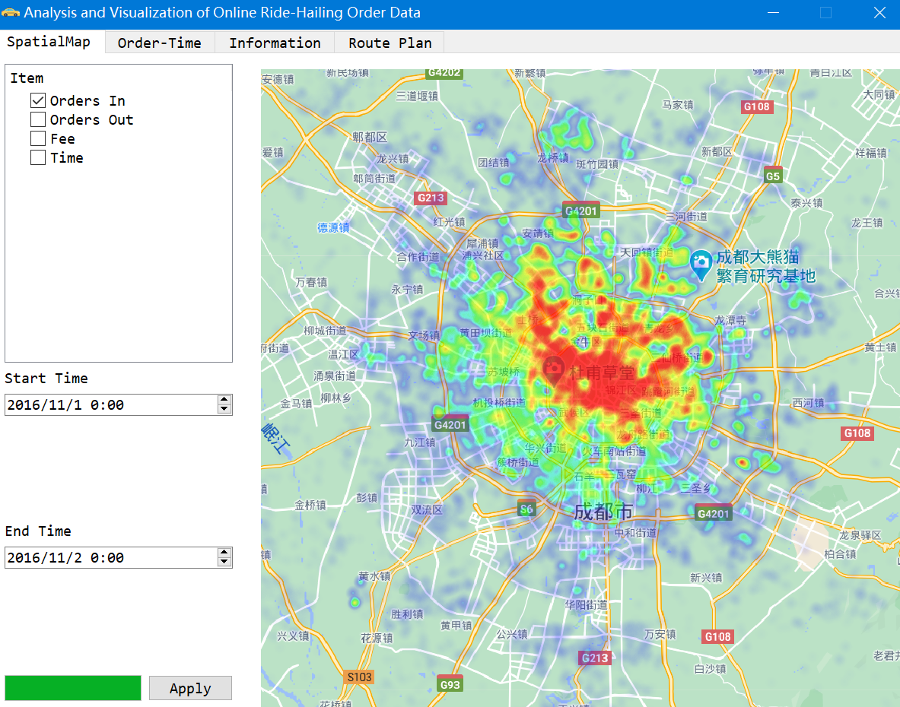
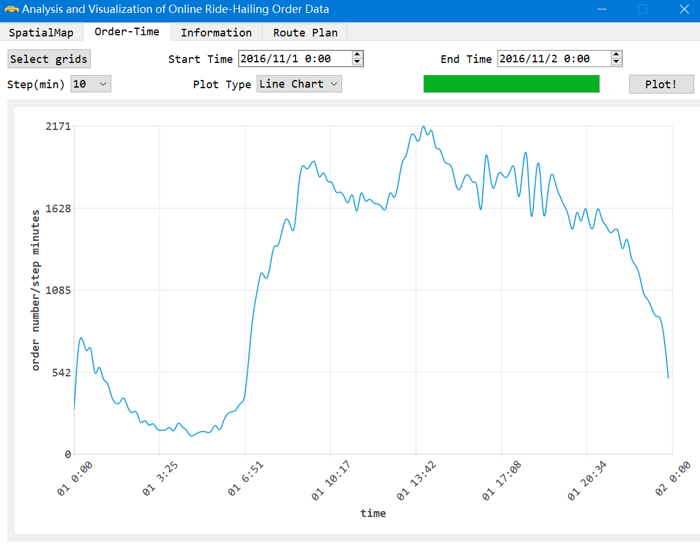
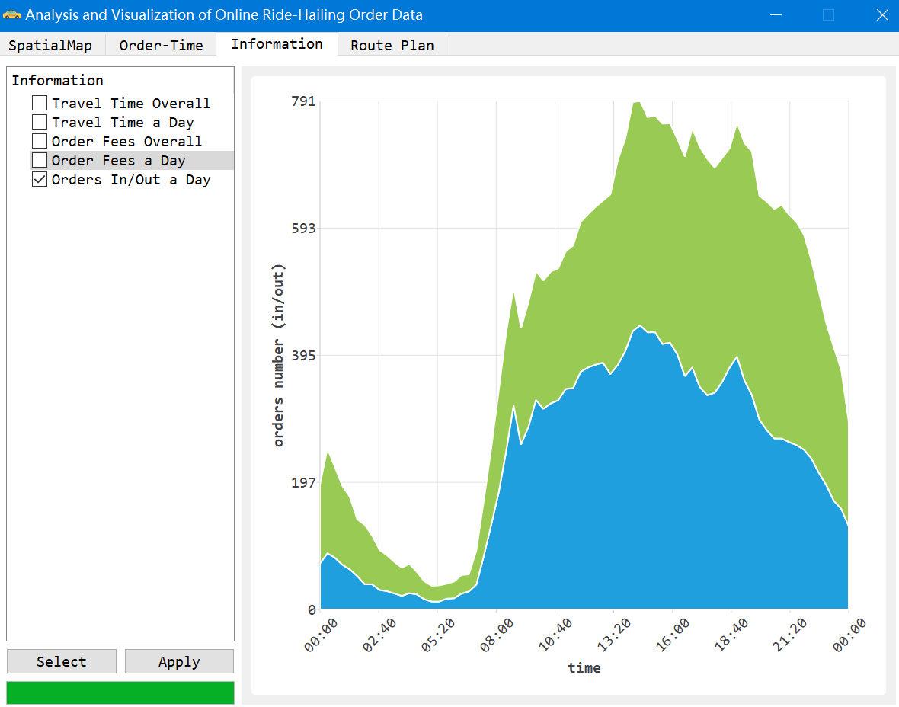
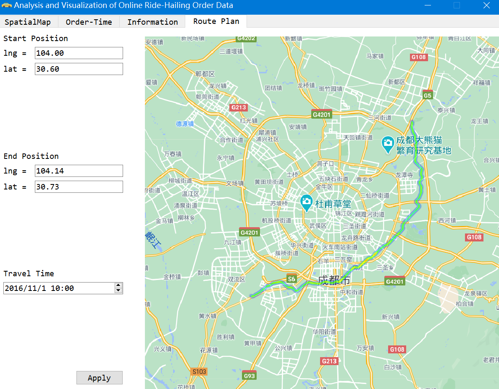

- Notice Before Running
  1. The image path in my code is "../xxx.png", so you need to build the project in the same folder to enable loading images successfully.
  
2. QChart library is needed. Besides, no other extern libraries are imported.
  
     

- Instructions when Running

  After building and running the project.

  The first window will be

  

  Click "select" to choose DataSet folder and then click "load".

  If you choose folder wrongly, you can just close it and start again.

  After loading data, main widget will show up.

  

  The main widget contains four tab widgets.

  - SpatialMap

    This section provides heat map graph. 
  
    You may only choose one item and a time span. Then click "Apply".
  
  
  
  - Order-Time
  
    In this, both line chart and pie chart is provided.
  
    First, click "select grids" to choose some grids. (Default: full)
  
    Then choose time span, time step and plot type.
  
    Finally click "plot!".
  
    Notice: When there are too many periods in Pie Chart, it will not show time tag.
  
  
  
  - Information
  
    This section provides some other important information.
  
    First, click "select grids" to choose some grids. (Default: empty)
  
    Then, you may only choose one information at once.
  
    Finally, click "Apply".
  
    Notice: Overall image may be out of tune at first, but you can use mouse to enlarge it.
  
  
  
  - Route Plan
  
    This section provides route plan.
  
    Just enter the longitude and latitude of start end end position and choose travel time.
  
    Then click "Apply"
  
  