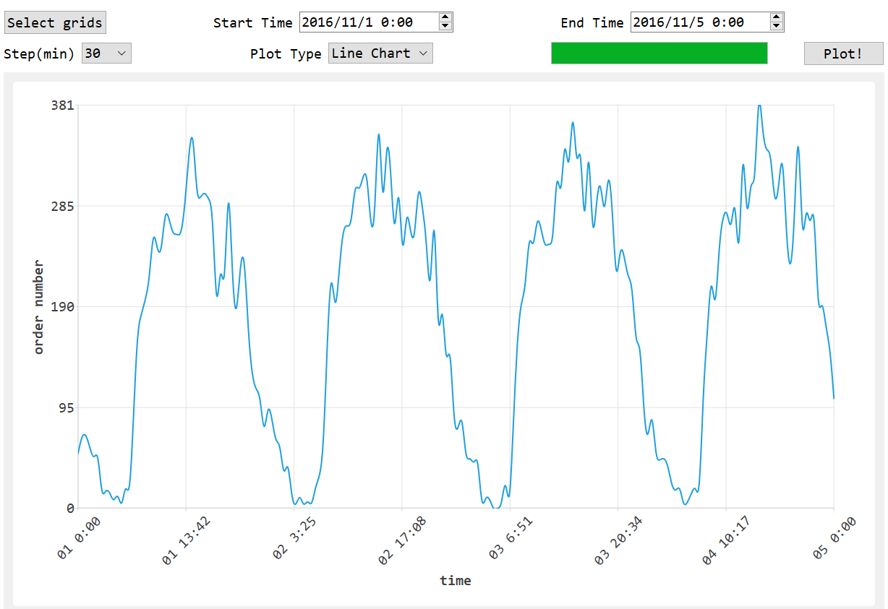
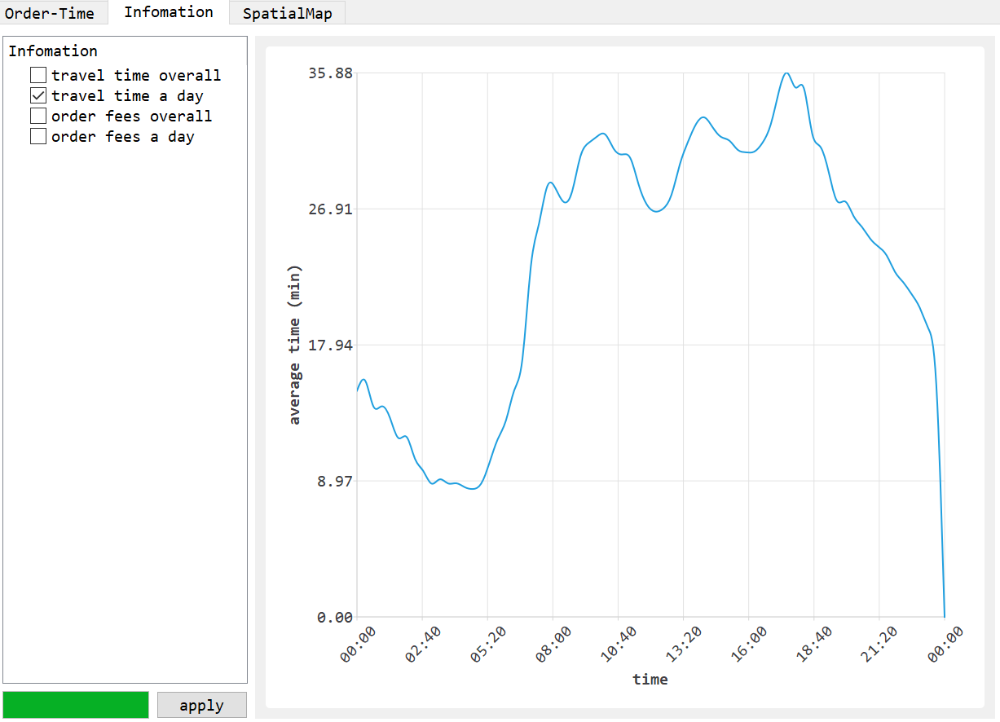

## 版本记录

- [ ] 美化欢迎界面
- [ ] 图标
- [ ] 支持后期删除和加入数据x
- [ ] 数据选择
- [ ] 数据可视化
- [ ] 地图绘制
- [ ] elective：thermal/direction
- [ ] elective：route plan (单源最短路)
- [ ] 增加数据处理线程
- [ ] 多线程计算
- [ ] 多线程加快读入
- [ ] 修复内存泄漏x

### 开发中

#### 模块列表

| 名称          | 作用                                         | 函数                 |
| ------------- | -------------------------------------------- | -------------------- |
| MainWindow    | 主界面                                       |                      |
| WelcomeWidget | 欢迎界面，选择数据，调用DataBase读取         | getPath/setBarValue  |
| myThread      | 发送funcStart信号                            |                      |
| DataBase      | 存储数据的类，解析文件夹，读取数据，处理数据 | parseFolder/loadData |
| SpatialPlot   | 用于生成绘制空图案的widget                   | setupLayouts         |
| TimePlot      | 绘制时间相关内容                             |                      |
| InfoPlot      | 绘制其它重要信息                             |                      |
| xxxPlot       | 上述三个绘图类的基类                         |                      |
|               |                                              |                      |

#### Ver 0.1

- [x] `welcome widget`

欢迎界面，可以选择数据导入，有进度条显示进度

- [x] `mainwindow`

导入数据完成关闭`welcome`，打开`mainwindow`

#### Ver 0.11

- [x] 导入数据支持使用另一个线程

#### Ver 0.2

- [x] 刚完成简陋的布局，后端逻辑没有任何进度

主界面使用`QTabWidget`管理多个窗口，画图区域使用`xxxPlot`类生成布局

空间地图：左侧筛选数据，右侧空间地图

时间绘图：上部给出一些按钮，下部绘图

重要信息绘图：左侧选择信息，右侧绘制

#### Ver 0.21

- [x] 重写Ver0.11引入的另一个线程类，并入`DataBase`

`DataBase`有了读取数据的方法，`myThread`仅发送开始信号

#### Ver 0.3

lambda表达式和函数指针真好用.jpg

- [x] 处理数据，排序分类，时间转换
- [x] 完成线图，暂时无法实现另一个线程运行，在setChart时会遇到段错误
- [x] 完成饼图，同上
- [x] 插值绘制线图，QSplineSeries
- [x] 使用一个虚基类xxxPlot重构了三个绘图类

#### Ver 0.4

- [x] 完成其它信息绘制

单位时间内行程平均时间/平均费用图形

类型：所有15天全部展开，或者每天相同时间累加到一起

#### Ver 0.5

修复之前的bug

`todo`

- [x] 数据处理在数据读入之后进行，在全部完成后再转到主界面
- [x] ~~读取数据增加cancel。~~无法添加cancel，但是增加了select和load
- [x] 在DataBase中增加time和fee的前缀和来加快速度
- [x] 添加了`SeriesAnimations`绘图动画，~~但似乎太快了...~~
- [x] 添加了`RubberBand`，支持鼠标缩放来避免过于密集
- [ ] 添加图例注记，颜色调整
- [x] 使用QDateTimeEdit，修复时间转换的bug，~~大家都喜欢晚上开车.jpg~~
- [x] 增加一个可以选择`grid`的`Dialog`
- [ ] 给上述`Dialog`添加背景图片
- [x] 程序结束后段错误......由于不同地方用了同一个spacer的指针....
- [x] 画图速度太快了....直接在主线程处理....

#### Ver 0.6

`todo`

- [ ] 完成热力图

#### Ver 0.7

`todo`

- [ ] 完成路线规划

---

### 基本开发完成

#### Ver1.0

- [ ] 完成基本功能

#### Ver 1.1

- [ ] 美化背景

#### Ver 1.11

- [ ] 美化图标

#### Ver 1.2

- [ ] 优化数据处理及绘图的速度

#### Ver 2.0

- [ ] 完成report

#### Ver 2.1

- [ ] 完成demo

