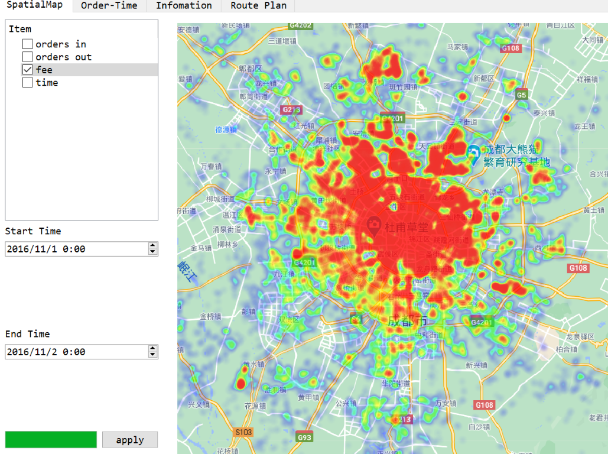

## 版本记录

- [ ] 支持后期删除和加入数据x
- [ ] 增加数据处理线程x
- [ ] 多线程加快读入x
- [ ] 修复内存泄漏x

### 开发中

#### 模块列表

| 名称          | 作用                                                      | 函数                       |
| ------------- | --------------------------------------------------------- | -------------------------- |
| MainWindow    | 主界面，包含四个tab                                       |                            |
| WelcomeWidget | 欢迎界面，选择数据，调用DataBase读取                      | getPath/                   |
| myThread      | 发送funcStart信号                                         |                            |
| DataBase      | 存储数据的类，解析文件夹，读取数据，处理数据，Count类函数 | parseFolder/loadData/Count |
| SpatialPlot   | 用于生成绘制热力图的widget                                |                            |
| TimePlot      | 绘制时间相关内容（线图，饼图）                            |                            |
| InfoPlot      | 绘制其它重要信息（流入流出比，fee，time）                 |                            |
| RoutePlan     | 用于路径规划                                              |                            |
| xxxPlot       | 上述四个绘图类的基类                                      |                            |
| GridSelector  | 选择grid id的对话框                                       |                            |
| HeatMap       | 绘有地图的热力图背景窗口                                  |                            |
| RouteMap      | 路径规划的窗口                                            |                            |
|               |                                                           |                            |

#### Ver 0.1

- [x] `welcome widget`

欢迎界面，可以选择数据导入，有进度条显示进度

- [x] `mainwindow`

导入数据完成关闭`welcome`，打开`mainwindow`

#### Ver 0.11

- [x] 导入数据支持使用另一个线程

#### Ver 0.2

- [x] 刚完成简陋的布局，后端逻辑没有任何进度

主界面使用`QTabWidget`管理多个窗口，画图区域使用`xxxPlot`类生成布局

空间地图：左侧筛选数据，右侧空间地图

时间绘图：上部给出一些按钮，下部绘图

重要信息绘图：左侧选择信息，右侧绘制

#### Ver 0.21

- [x] 重写Ver0.11引入的另一个线程类，并入`DataBase`

`DataBase`有了读取数据的方法，`myThread`仅发送开始信号

#### Ver 0.3

lambda表达式和函数指针真好用.jpg

- [x] 处理数据，排序分类，时间转换
- [x] 完成线图，暂时无法实现另一个线程运行，在setChart时会遇到段错误
- [x] 完成饼图，同上
- [x] 插值绘制线图，QSplineSeries
- [x] 使用一个虚基类xxxPlot重构了三个绘图类

#### Ver 0.4

- [x] 完成其它信息绘制

单位时间内行程平均时间/平均费用图形

类型：所有15天全部展开，或者每天相同时间累加到一起

#### Ver 0.5

修复之前的bug

- [x] 数据处理在数据读入之后进行，在全部完成后再转到主界面
- [x] ~~读取数据增加cancel。~~无法添加cancel，但是增加了select和load
- [x] 在DataBase中增加time和fee的前缀和来加快速度
- [x] 添加了`SeriesAnimations`绘图动画，~~但似乎太快了...~~
- [x] 添加了`RubberBand`，支持鼠标缩放来避免过于密集
- [x] `TimePlot`添加注记、坐标轴
- [x] 使用QDateTimeEdit，修复时间转换的bug，~~大家都喜欢晚上开车.jpg~~
- [x] 增加一个可以选择`grid`的`Dialog`
- [x] 给`grid Dialog`添加背景图片
- [x] `Animation`没有效果，是option不是duration...
- [x] 折线图拖动时坐标轴不会变化....，add之后才能attach
- [x] `InfoPlot`添加注记、坐标轴
- [x] `InfoPlot`增加流入流出对比
- [x] `InfoPlot`添加`Dialog`选择grid id
- [x] 程序结束后段错误......由于不同地方用了同一个spacer的指针....
- [x] 画图速度太快了....直接在主线程处理....

#### Ver 0.6

- [x] 完成热力图

- [x] 在右侧绘制地图，使用`QPainter`绘制地图
- [x] 在`DataBase`中新增了count至pixel的方法

每个像素点根据经纬度，确定item数量

根据像素点的权值来渐变设置颜色

先绘制透明度图片，以便相互叠加，再转化为热力图

之后将热力图叠加到地图上

- [x] in order极差过大效果较差，使用$\sqrt{x}$来平滑极差

#### Ver 0.7

- [x] 完成路线规划
- [x] 增加`RoutePlan`的窗口
- [ ] 鼠标点击转化为经纬度x
- [x] 最短路规划路径
- [x] SPFA改用Dijkstra算法
- [x] 绘制路径，类似热力图显示拥挤路段

---

### 基本开发完成

#### Ver1.0

- [x] 完成基本功能（大概

  多线程导入数据

  线图+饼图

  其它信息展示

  热力图

  路径规划

- [x] 添加了icon:oncoming_taxi:修改了标题

#### Ver 1.1

- [ ] 美化背景x

#### Ver 1.2

- [ ] 优化数据处理及绘图的速度x

#### Ver 2.0

- [x] 完成report

#### Ver 2.1

- [ ] 完成demo

