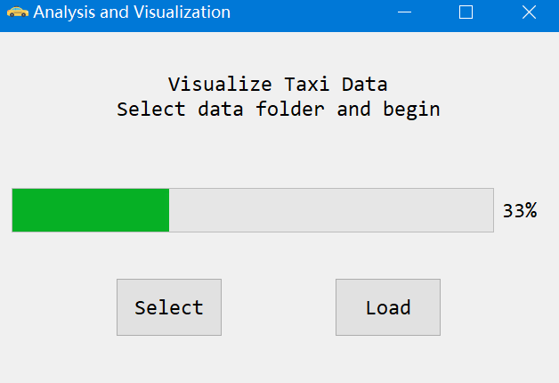
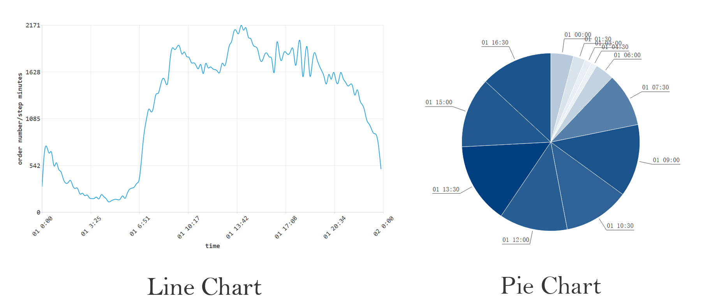
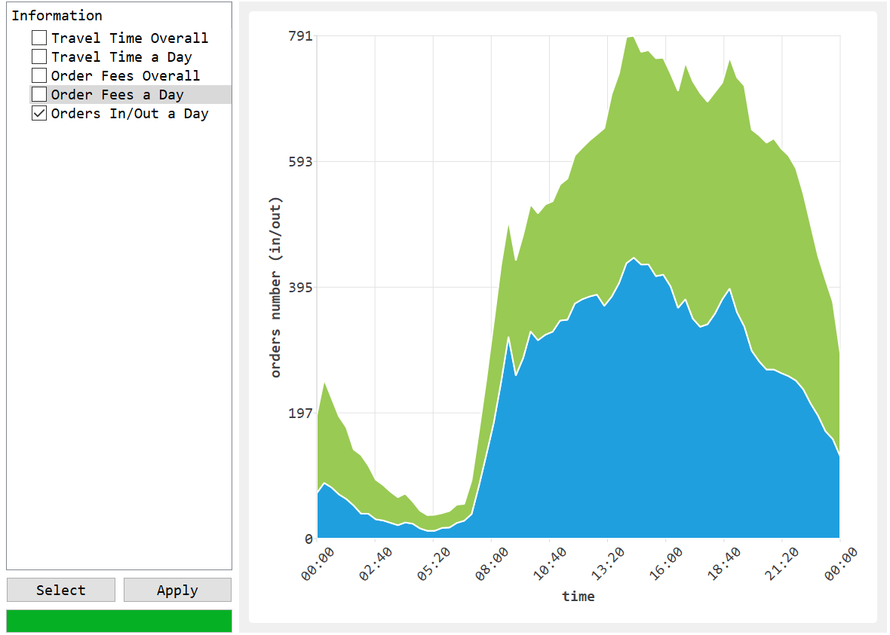
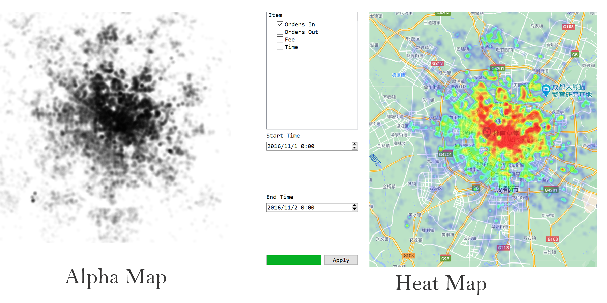
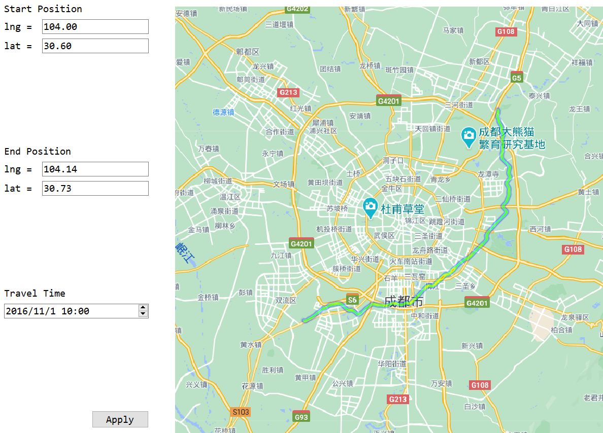
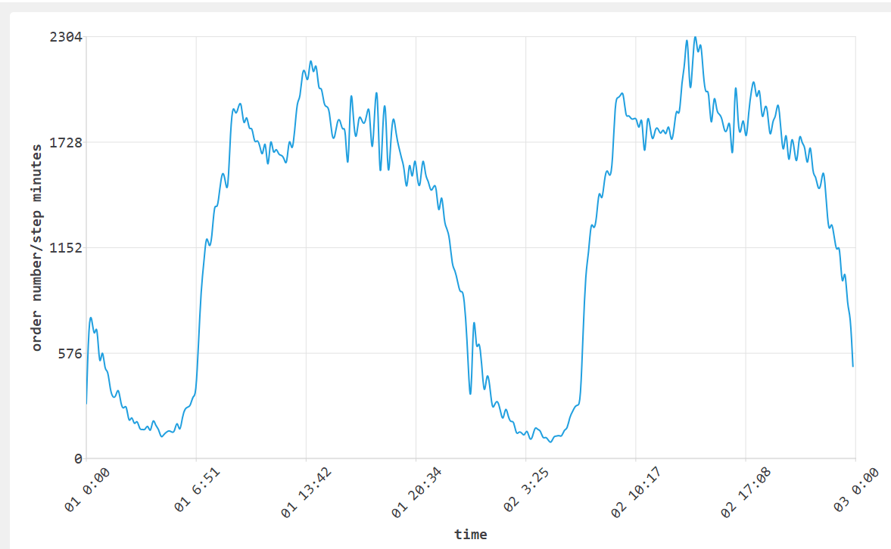
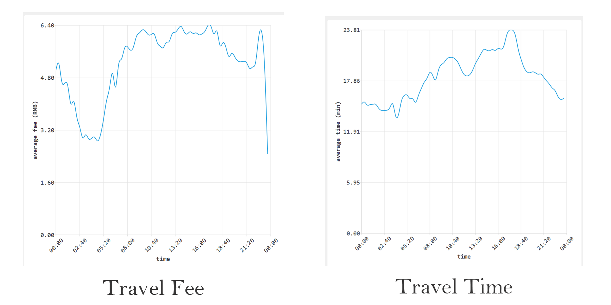
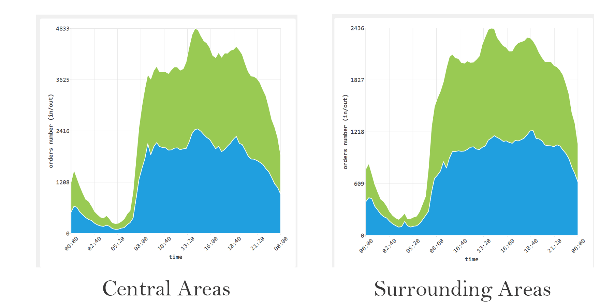
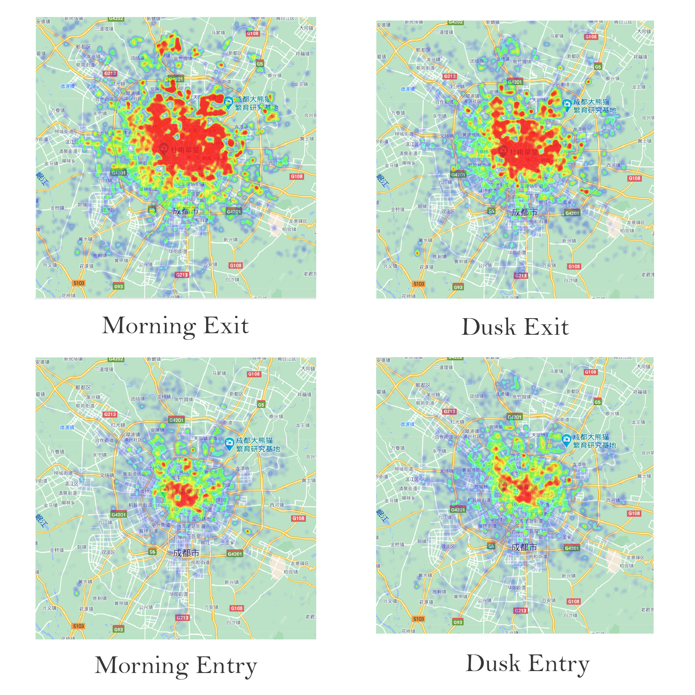

## CS241 Final Project

### Analysis and Visualization of Online Ride-Hailing Order Data:oncoming_taxi:

#### 1 Introduction

​	This project is aimed to analyze and visualize online ride-hailing order data from DiDi, which can provide some through insights of data through multiple types of graphs and help user plan route accordingly.

​	The instructions of using this application is in "README.pdf". Besides, the demo also shows how to use it.

#### 2 Implementation Details

##### 2.1 Data Load and Analysis

​	Data load is undoubtedly is of the most essential part of the whole project. And "DataBase" class is a functor for this, which reads, stores and processes data. 

​	Two structs are designed to store data.

| Basic Struct |                                                   |
| ------------ | ------------------------------------------------- |
| Tour         | start time, end time, destination, source and fee |
| Grid         | longitude, latitude and grid id                   |

​	Additionally, in "DataBase", data are stored as the following tables.

|                                 | Original Data                   |                           |
| ------------------------------- | ------------------------------- | ------------------------- |
| lat&lng: longitude and latitude | file_info: all data file's path | grids: each grid's domain |

|                                 | Processed Data       |                               |
| ------------------------------- | -------------------- | ----------------------------- |
| start_tour: tour start from [i] | end_tour: end in [i] | fee_sum, time_sum: prefix sum |

###### 2.1.1 Data Load

​	As "DataBase" Class is inherited from QObject, it has "movetoThread" function. After selecting folder's path, "DataBase" class is moved to another thread and is sent a start signal to. 

​	As it runs on another thread, main thread isn't struck and user can close the window at will. 

​	While it runs well on another thread, it can also send back signal to change progress bar after finishing each single file. Then, after loading all the files, it will be moved back to main thread.

###### 2.1.2 Data Pre-process

​	Data pre-process starts just after finishing loading. In this section, original tour data are copied to "start_tour"(end_tour) array, which stores tour started from (ended in) grid[i].

​	Data in each grid is sorted along time. This makes it possible to query order numbers in each grid in $O(logN)$ with binary search. Beside, prefix sum of fee and travel time are also calculated and this enables using $sum[end]-sum[start]$ to calculate time or fee over a certain period, which also has a complexity of $O(logN)$.

##### 2.2 Graph Plot

​	All the four graphs are attached as tab widgets in the main window.

​	It's a lot more faster to plot graphs than loading data and the application almost never be stuck. So I just use main thread for this, with a progress bar to indicate its progress.

###### 2.2.1 Line Charts and Pie Charts

​	"Rubber Band" is used in line chart, which allow user to scale the graph. "Chart Animation" is also enabled, which shows the process of plotting. You can see it in the demo.

​	User can tune time span, time step, plot type and grids selected graphically.

​	As for line charts, the application uses binary search to count order number in "DataBase". Additionally, "QSplineSeries" is used to smooth the line, which contains interpolation. 

​	As for pie charts, color of each period varies according to its order number's proportion. And the more darker the color is, the more orders it contains. To avoid a crowd of labels, labels will be invisible if the amount of periods is too large.

###### 2.2.2 Other Important Information

​		"Rubber band" and "Chart animation" are also used in this chart.

​	There are basically two time span to choose from. "Overall" provides a chart with all the 15 days' data. It may out of tune at first, but user can scale it at will. "A Day" provides a chart which counts the same period every day into one day and shows an outlook of data.

​	There are basically three types of information. "Travel Time" provides an average travel time in selected grids and "Order Fee" provides an average order fee. As for "Order In/Out", it provides an area map to display the in&out proportions.

###### 2.2.3 Heat Map

​	Heat map shows a thorough and insightful view. The process of plotting heat map is a little tricky.

​	First, plot area is divided into 845x845 pixels. And the amount of selected item in each pixel is calculated.

​	Second, to enable a mix of different area, an alpha map was generated first. According to the proportion, dark of light ellipses are drawn. While they are in alpha, they can mix well. Just as the left figure above shows.

​	Third. the alpha map was transfer in to a color map, which use gradient colors to show the proportion of each pixel. Additionally, when maximum and minimum amount differ too much, $\sqrt{value}$ is applied to smooth color. 

###### 2.2.4 Route Plan

​	Route Plan section helps user to plan route according to the traffic distribution. The process of route plan is akin to heat map.

​	To begin with, the number of orders ended in each grid is calculated.  Undoubtedly, more order indicates a more heavy traffic.

​	Then, "Dijkstra Algorithm" is used to calculate the shortest path from start position to end position. To find a smooth path, each pixels is connected to 8 nearby pixels. Beside, to avoid straight lines, each pixel has a bias value.

​	Finally, find all pixels passed by and use same scheme from heat map to plot route.

#### 3 Results

##### 3.1 Order Number

​	Order number shows a periodical change during a day. 

​	As show in the figure above, the number raises rapidly at about 7 am and remains a high level until 8 pm. At noon, there's also a general peak.

##### 3.2 Fee and Travel Time

​	Travel fee and time basically show the same pattern as order number. However, travel fee shows an additional peak nearly mid night, while travel time shows an additional afternoon peak.

##### 3.3 Order In/Out

​	In central area, as show in left figure above, there's more orders entry than exit at 8 am, while there's more exit than entry at 6 pm.

​	However, in surrounding area, as show in right figure above, there's totally a reverse.

##### 3.4 Order-Area

​	These show a more thorough view of conclusion above.

​	In general. people travel from surrounding areas into central areas in the morning and go back in the late afternoon.

#### 4 Discussions

​	The application's running time is as follows.

| Task                            | Time(s)    |
| ------------------------------- | ---------- |
| Load Dataset                    | 7.5        |
| Data Pre-process                | 0.8        |
| Full Order-time Chart           | $\leq0.5$  |
| Full Pie Chart(not recommended) | 1          |
| Full Info Chart                 | $\leq 0.5$ |
| Full Heat Map                   | 3          |
| Route Plan                      | 1          |

​	After pre-processing data, it largely reduces query complexity. Besides, with the in-memory functor "DataBase", the application runs faster compared to regular SQL. In general, this application both efficient and insightful.