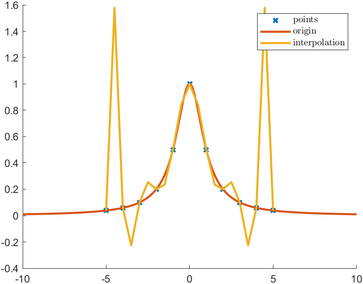

## Homework2

[TOC]

#### Q2

The complexity of both my Lagrange interpolation and Newton interpolation is $O(N^2)$

#### Q3



We can find that results of both interpolation methods are exactly the same. Because n unique points can determine only one $P_n$. Additionally, though interpolation results can meet the original line at given points, it differs largely from the original line in other values, which I find may be Runge phenomenon after searching through Internet.

#### Appendix

- MATLAB code

```matlab
x=-5:1:5;
y=[0.0385,0.0588,0.1,0.2,0.5,1.0,0.5,0.2,0.1,0.0588,0.0385];
t=-10:.05:10;
h=-5:0.5:5;
L_result=[0.038,1.579,0.059,-0.226,0.100,0.254,0.200,0.235,0.500,0.843,1.000,0.843,0.500,0.235,0.200,0.254,0.100,-0.226,0.059,1.579,0.038];
N_result=[0.038,1.579,0.059,-0.226,0.100,0.254,0.200,0.235,0.500,0.843,1.000,0.843,0.500,0.235,0.200,0.254,0.100,-0.226,0.059,1.579,0.038];
figure;
hold on;
plot(x,y,'x',"LineWidth",2);
plot(t,1./(1+t.^2),"LineWidth",2);
plot(h,L_result,"LineWidth",2);
legend('points',"origin","interpolation","interpreter","latex");
```

