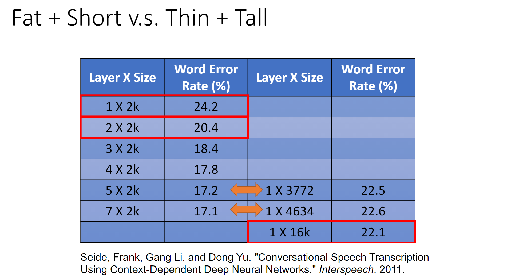
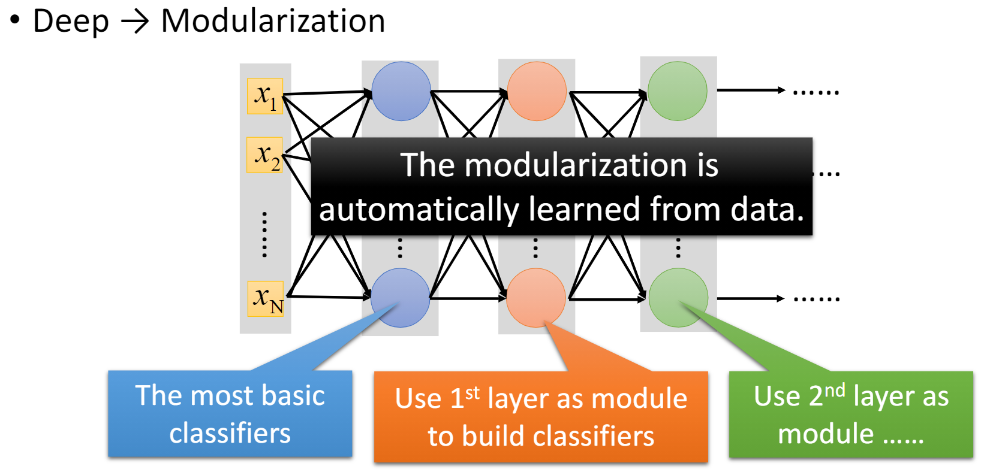
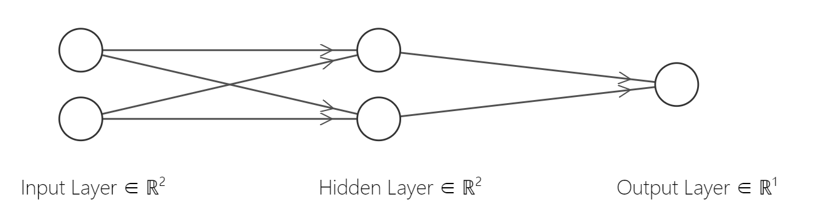

[TOC]

#### problem1

1. 深度比广度更优秀

   下图为课件上的实验结果

   

   同时深度也可以使得网络模组化

   

2. 我认为主要有以下几点

   - 每一层的节点个数
   - 层次间节点的连接方式
   - 节点的激活函数
   - 最终的损失函数

   - 参数优化器的类型/学习率
   - epoch/batch的大小，训练的次数


#### problem2

如图建立网络

其中output layer不设置激活函数，其余所有节点均使用ReLU

output value>0.5 结果为1否则结果为0

在附录中附有python实现的代码，




#### problem3

1. training

   | input | hidden layer | output       |
   | ----- | ------------ | ------------ |
   | 1     | max(-1,0)=0  | max(8-4,0)=4 |
   | x     | max(2+2,0)=4 | max(-2,0)=0  |
   | 2     | x            |              |
   | 1     | max(1,0)=1   |              |

2. testing

   weight x 0.75

   | input | hidden layer          | output                    |
   | ----- | --------------------- | ------------------------- |
   | 1     | max((-1+5)*0.75,0)=3  | max((-3+6-3)*0.75,0)=0    |
   | 2     | max((2+2)*0.75,0)=3   | max((3-1.5)*0.75,0)=1.125 |
   | 2     | max((3-2-2)*0.75,0)=0 |                           |
   | 1     | max((1)*0.75,0)=0.75  |                           |

   


#### Appendix

- problem2

  ```python
  import tensorflow as tf
  import numpy as np
  import random
  
  print(tf.__version__)
  from tensorflow import keras
  from tensorflow.keras import layers
  
  inputs = keras.Input(shape=(2), name='num')
  x = layers.Dense(units=2, activation=tf.nn.relu)(inputs)
  outputs = layers.Dense(units=1)(x)
  
  model = keras.Model(inputs=inputs, outputs=outputs, name='MLP_XOR')
  model.summary()
  
  train_T = 500
  X_train = np.zeros((train_T, 2))
  Y_train = np.zeros(train_T)
  for i in range(train_T):
      a = random.randint(0, 1)
      b = random.randint(0, 1)
      X_train[i][0] = a
      X_train[i][1] = b
      Y_train[i] = a ^ b
  
  learning_rate = 0.01
  model.compile(optimizer=tf.keras.optimizers.Adam(learning_rate), loss='mse')
  model.fit(X_train, Y_train, batch_size=16, epochs=5, validation_split=0.1)
  
  test_T = 20
  for i in range(test_T):
      a = random.randint(0, 1)
      b = random.randint(0, 1)
      inputs = np.array([a, b]).reshape(1, 2)
      print(str(a) + "^" + str(b) + "=" + str(a ^ b))
      result = model.predict(inputs) > 0.5
      print("predict: {0:2f}".format(result[0][0] > 0.5))
  
  model.save('MLP_XOR.h5')
  ```

  

