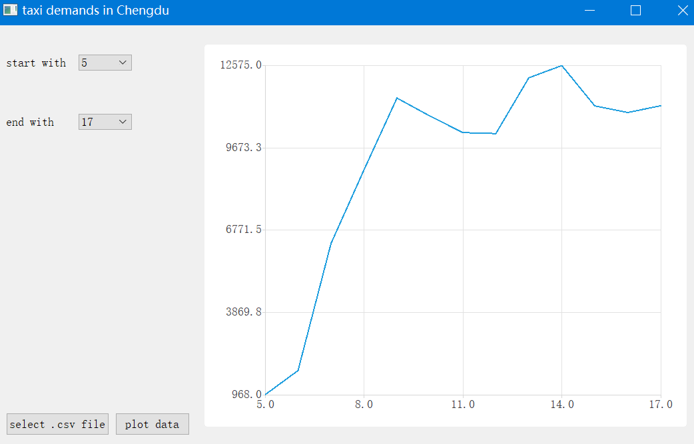

OS: windows

after build the project, it yields like:

The following steps show how to plot data:

1. click "select .csv file" in left bottom corner and select data

2. tune numbers in left upper boxes remarked by "start with" and "end with"
3. click "plot data"

