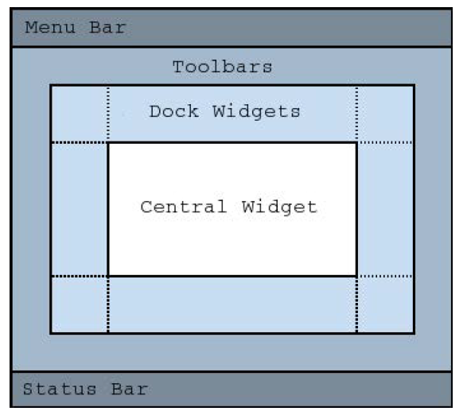

# Notes about Qt

[TOC]

### signals and slots

event-driven

Listener+Callback

```c++
// Always void
// one to multiple
emit aSignal();

// slots are normal cpp functions
connect(A,&A::a,B,&B::b)
// can ignore arguments, but can't create from nothing    
```


### components

inherit from QObject

#### 1.hierachy tree

```c++
layout = new A();
label = new B("xxx",A);
```

#### 2.common widgets

properties: enabled/visible

##### 2.1Text widgets

###### QLabel

```c++
label = new QLabel("xxx",parent);
```

###### QLineEdit

```c++
line = new QLineEdit(parent);
line->SetText("xxx");
line->setEchoMode(QLineEdit::Password);
```

###### QTextEdit

```c++
edit = new QTextEdit(parent);
edit->setPlainText("xxx");
edit->append("xxx");
connect(edit,&edit::textchange,...);
```

##### 2.2Button widgets

###### QPushButton/QCheckBox/QRadioButton

```c++
// clicked (released)
clicked();
// change state
toggled();

// Properties
checkable/checked/text/icon
button->setIcon(QIcon("dir.."));
```

##### 2.3Value widgets

###### QSlider/QProgressBar/QSpinBox

```c++
slider = new QSlider(Qt::Horizontal,parent);
slider->setRange(0,99);
slider->setValue(42);

// %w for value; %p for percentage
progress->setFormat("%v (%p%)");
```

##### 2.4Organizer widgets

###### QGroupBox/QTabWidget

```c++
tab->addWidget(xxx,icon,"xxx");
```

#### 3.Layout management

```c++
outerlayout = new QVBoxLayout(this);
// construct xxx1
outerlayout->addLayout(xxx1);
outerlayout->addSpacerItem(xxx);
/// construct xxx2
outerlayout->addLayout(xxx2);
```

size policies (in lecture-slides)

#### 4.Painting

paint with a painter on a paint device during a paint event

##### 4.1QPaintDevice

On-Screen: QWidget

Off: QImage, QPixmap

```c++
void Your_Widget::paintEvent(QPaintEvent *) override
{
    QPainter painter(this);
    painter.drawRect(0,0,100,200); //x,y,w,h
}
```

##### 4.2Geometry helper

QPoint(x,y)/QLine(p1,p2)/Qsize(w,h)/QRect(point,size)

RGB::QColor(255,0,0)...

QPen/QBruch

```c++
QPainter painter(this);
QPen pen = painter.pen();
pen.setBrush(Qt::red);
pen.setWidth(3);
painter.setPen(pen) ;
painter.setRenderHint(QPainter::Antialiasing);
painter.drawRect(0,0,100,200);
```

use xxx.show() afterwards


### Application and Dialog

#### 1.QMainWindow




Central Widget

```c++
QMainWindow::setCentralWidget(widget)
```

QDockWidget/QStatusBar

##### 1.1QAction

```c++
void MainWindow::setupActions()
{
    QAction *action=newQAction("Open...",this);
    action->setIcon(QIcon(":/images/open.png"));
    action->setShortcut(QKeySequence::Open);
    action->setStatusTip(tr("Openfile"));
    connect(action,SIGNAL(triggered()),this,SLOT(onOpen()));
    xxx->addAction(action);
    ...
}
```

##### 1.2QMenuBar

```c++
void MainWindow::setupMenuBar()
{
    QMenuBar *bar=menuBar();
    QMenu *menu=bar->addMenu("&File");
    menu->addAction(action);
    menu->addSeparator();
    QMenu *subMenu=menu->addMenu("SubMenu");
    ...
}
```

##### 1.3QToolBar

movable panel

```c++
void MainWindow::setupToolBar()
{
    QToolBar *bar=addToolBar("File");
    bar->addAction(action);
    bar->addSeparator();
    bar->addWidget(new QLineEdit("Find..."));
	...
}
```

##### 1.4QToolButton

```c++
QToolButton *button=new QToolButton(this);
button->setDefaultAction(action);
//Can have a menu
button->setMenu(menu);
//Shows menu indicator on button
button->setPopupMode(QToolButton::MenuButtonPopup);
//Control over text + icon placements
button->setToolButtonStyle(Qt::ToolButtonTextUnderIcon);
```

#### 2.File

##### 2.1Path

```c++
QDir d = Qdir::root();
QDir::current();
QDir::home();
QDir::temp();
```

##### 2.2QFile

```c++
QFile f("dir..");
// read
if (!f.open(QIODevice::ReadOnly))
    qFatal("xxxx");
// 1
QByteArray data = f.readAll();
// 2
while (!f.atEnd())
    data = f.read(100);
f.close();

// write
if (!f.open(QIODevice::WriteOnly))
    qFatal("xxxx");
f.write(data);
f.close();
```

#### 3.Dialog

QDialog

special window requires immediate attention

QProgressDialog/QErrorMessage/QInputDialog/QColorDialog/QFontDialog

##### 3.1Modal dialog/Modeless dialog

```c++
QDialog dialog(this);
if (dialog.exec()==Dialog::Accepted)
{
    // blocked...
}
```

```c++
dialog->show();
dialog->raise(); // on top
dialog->activateWindow(); // keyboard focus
```

##### 3.2QFileDialog

```c++
QString fileName=QFileDialog::getOpenFileName(this,"OpenFile");
if (!fileName.isNull())
    ...
// getSaveFileName()
// getExistingDirectory()
```

##### 3.3QMessageBox

ask and receive

```c++
QMessageBox::StandardButton ret = QMessageBox::question(parent,title,text);
if (ret == QMessageBox::Ok)
    ...
```

##### 3.4Customize