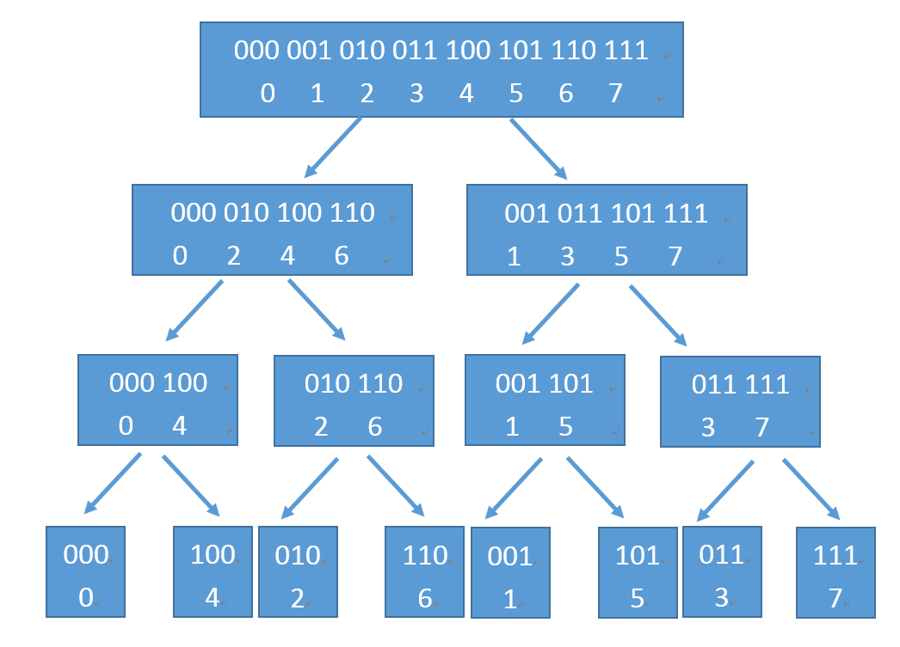
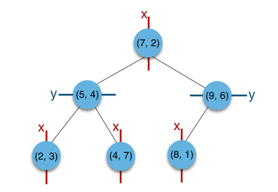

[TOC]

#### FFT

> 复习了一下之前不太理解的快速傅里叶变换
>
> ~~DFT yyds...~~
> $$
> A(\omega^k_n)=A_0(\omega^k_\frac{n}{2})+\omega^k_n\times A_1(\omega^k_\frac{n}{2})
> $$
>
> $$
> A(\omega^{k+\frac{n}{2}}_n)=A_0(\omega^k_\frac{n}{2})-\omega^k_n\times A_1(\omega^k_\frac{n}{2})
> $$
>
> 
>
> 参考链接：[link](https://zhuanlan.zhihu.com/p/31584464)

#### K-D Tree

> 一直想写但没写的K-D Tree
>
> 通常用于静态查找
>
> 
>
> ~~BVH Tree还是香~~
>
> `build`：按维度依次排序(nth_element)，复杂度$O(nlogn)$
>
> ​	notice：代码中的build在有相同值的条件下可能存在右子树=自己
>
> `insert`：常规操作，参考BST
>
> `single search`：常规操作，参考BST
>
> `remove`：找右子树里相同维度的min，或者左子树里相同维度的max，递归
>
> `range search`：待续
>
> `closest search`：仿照BVH，再维护一个bounding box，~~那这还是K-D Tree么~~
>
> 待续

#### NN

> 朴素神经网络
>
> 待续

待续